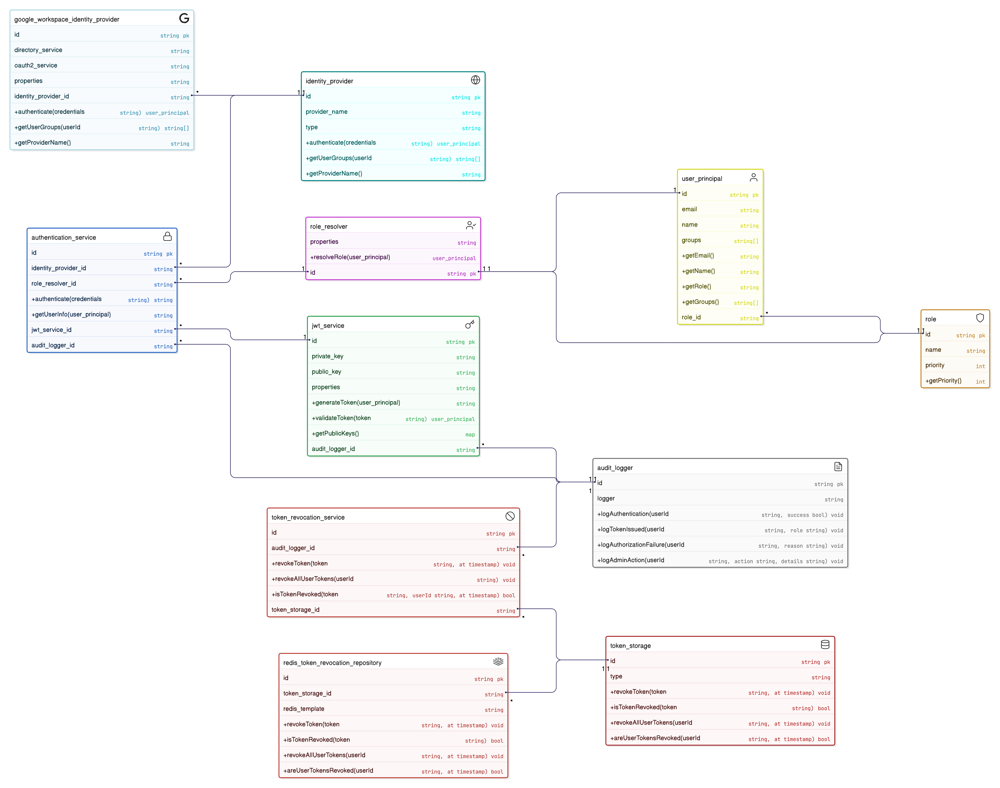
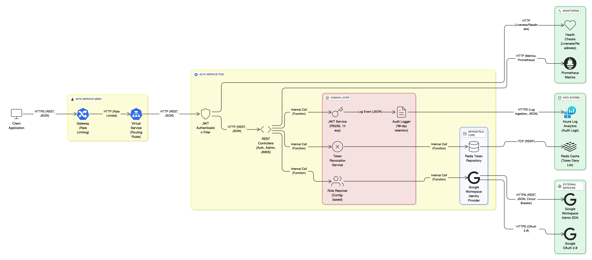

# HAI-Indexer Authentication Service

**Version:** 2.1.1
**Status:** ✅ Build Successful | Ready for Deployment
**Last Updated:** 2026-01-06

> **Important:** This project requires **Java 21** (not Java 24) for successful compilation due to Lombok compatibility.

## 📋 Quick Links

- [Build Success Summary](BUILD_SUCCESS_SUMMARY.md) - Build details and next steps
- [Architecture Diagrams](docs/ARCHITECTURE_DIAGRAMS.md) - All 8 architecture diagrams (Mermaid)
- [Visual Diagrams](docs/diagrams/) - UML, Flow, and Sequence diagrams (PNG)
- [Deployment Guide](docs/DEPLOYMENT_GUIDE.md) - Complete deployment instructions
- [Design Review](docs/DESIGN_REVIEW_V2.1.1.md) - Design decisions and rationale
- [Build Troubleshooting](BUILD_ISSUES_AND_RESOLUTION.md) - Common issues and solutions

## 📐 Architecture Overview

### System Architecture



The service follows a **Hexagonal Architecture** pattern with clear separation of concerns:

- **Domain Layer**: Core business logic (JWT, User Principal, Roles)
- **Application Layer**: Use cases and orchestration
- **Infrastructure Layer**: External integrations (Google Workspace, Redis, Security)

### Authentication Flow



The authentication process follows OAuth 2.0 + JWT pattern:

1. User authenticates with Google Workspace
2. Service validates OAuth code and fetches user info
3. Service resolves user roles from Google Groups
4. Service issues JWT token with user claims
5. Client uses JWT for subsequent API calls

### Sequence Diagram


Detailed interaction flow between components during authentication and authorization.

## 🎯 Features

- **Authentication**
  - Google Workspace OAuth 2.0 integration
  - JWT token issuance (RS256 with JWKS)
  - JWT expiration: **1 hour** (P0 fix)
- **Token Revocation** (P0 fix)
  - Redis-based deny list
  - Revoke specific tokens by JTI
  - Revoke all user tokens
- **Audit Logging** (P0 fix)
  - Structured JSON logs (Logstash format)
  - 90-day retention for compliance
  - SOC 2 / ISO 27001 ready
- **Resilience** (P1 fix)
  - Resilience4j circuit breaker (50% failure threshold)
  - Graceful degradation (empty groups → INTERN role)
- **Rate Limiting** (P1 fix)
  - Istio-based rate limiting
  - Login: 5 req/min per IP
  - /auth/me: 60 req/min per user
  - JWKS: 100 req/min
- **Hexagonal Architecture** (P2 fix)
  - Identity Provider abstraction (Google, future: Azure AD, Okta)
  - Token storage abstraction (Redis, future: Cosmos DB)
  - Audit logger abstraction (Logback, future: Azure Monitor)
- **Configuration-based Role Mapping** (P2 fix)
  - No hardcoded roles
  - Configurable via application.yml
- **Enhanced Health Checks** (P2 fix)
  - Google Workspace connectivity
  - Redis connectivity
  - Liveness and readiness probes

## 🚀 Quick Start

### Build

**Important:** Must use Java 21 (not Java 24)

```bash
# Set Java 21
export JAVA_HOME=$(/usr/libexec/java_home -v 21)

# Build
mvn clean package -DskipTests
```

**Expected Output:**

```
[INFO] BUILD SUCCESS
[INFO] Total time:  3.775 s
[INFO] Artifact: target/auth-service-2.1.1.jar (55MB)
```

### Prerequisites

- Java 21 (NOT Java 24)
- Maven 3.9+
- Docker & Docker Compose
- Redis (for token revocation)
- Google Workspace account with admin access

### 1. Generate JWT Keys

```bash
chmod +x scripts/generate-jwt-keys.sh
./scripts/generate-jwt-keys.sh
```

### 2. Configure Google Workspace

1. Create a service account in Google Cloud Console
2. Enable Admin SDK API
3. Download service account JSON
4. Save to `secrets/service-account.json`
5. Configure domain-wide delegation

### 3. Run Locally with Docker Compose

```bash
# Set environment variables
export GOOGLE_DELEGATED_ADMIN=admin@haiintel.com
export GOOGLE_WORKSPACE_DOMAIN=haiintel.com
export REDIS_PASSWORD=devpassword

# Start services
docker-compose up -d

# View logs
docker-compose logs -f auth-service
```

### 4. Test the Service

```bash
# Health check
curl http://localhost:8080/actuator/health

# JWKS endpoint
curl http://localhost:8080/.well-known/jwks.json

# Login (requires Google OAuth code)
curl -X POST http://localhost:8080/auth/google/login \
  -H "Content-Type: application/json" \
  -d '{"authorizationCode": "YOUR_OAUTH_CODE"}'

# Get user info (requires JWT token)
curl http://localhost:8080/auth/me \
  -H "Authorization: Bearer YOUR_JWT_TOKEN"
```

## 📦 Deployment

### Kubernetes

```bash
# Create namespace
kubectl create namespace hai-indexer

# Create secrets
kubectl create secret generic jwt-keys \
  --from-file=jwt-private.pem=secrets/jwt-private.pem \
  --from-file=jwt-public.pem=secrets/jwt-public.pem \
  -n hai-indexer

kubectl create secret generic redis-secret \
  --from-literal=password=YOUR_REDIS_PASSWORD \
  -n hai-indexer

# Deploy
kubectl apply -f k8s/
kubectl apply -f k8s/istio/
```

### Azure (AKS)

See `terraform/` directory for Azure infrastructure automation.

## 🔧 Configuration

### Feature Toggles

All major features can be toggled via environment variables:

- `TOKEN_REVOCATION_ENABLED=true` - Enable/disable token revocation
- `AUDIT_ENABLED=true` - Enable/disable audit logging
- `RATE_LIMITING_ENABLED=true` - Enable/disable rate limiting
- `IDP_PROVIDER=google` - Identity provider (google, azure, okta)

### Role Mapping

Configure in `application.yml`:

```yaml
authorization:
  role-mappings:
    - group: "admin@haiintel.com"
      role: ADMIN
      priority: 1
    - group: "employees@haiintel.com"
      role: EMPLOYEE
      priority: 2
  default-role: INTERN
```

## 📊 Monitoring

- **Metrics:** http://localhost:8080/actuator/prometheus
- **Health:** http://localhost:8080/actuator/health
- **API Docs:** http://localhost:8080/swagger-ui.html

## 🔒 Security

- JWT expiration: 1 hour (P0 fix)
- Token revocation: Redis-based deny list (P0 fix)
- Audit logging: 90-day retention (P0 fix)
- Rate limiting: Istio-based (P1 fix)
- Circuit breaker: Resilience4j (P1 fix)

## 📚 Documentation

### Architecture & Design

- [Architecture Diagrams](docs/ARCHITECTURE_DIAGRAMS.md) - Mermaid diagrams with detailed descriptions
- [Visual Diagrams](docs/diagrams/) - UML, authentication flow, and sequence diagrams
- [Design Review](docs/DESIGN_REVIEW_V2.1.1.md) - Comprehensive design review
- [Review Summary](docs/REVIEW_SUMMARY.md) - Quick reference guide

### Implementation & Deployment

- [Implementation Checklist](docs/IMPLEMENTATION_CHECKLIST.md) - Progress tracking
- [Deployment Guide](docs/DEPLOYMENT_GUIDE.md) - Step-by-step deployment
- [Build Success Summary](BUILD_SUCCESS_SUMMARY.md) - Build verification
- [Build Troubleshooting](BUILD_ISSUES_AND_RESOLUTION.md) - Common issues

## 🧪 Testing

```bash
# Run unit tests
mvn test

# Run integration tests
mvn verify

# Run with coverage
mvn clean verify jacoco:report
```

## 📝 License

Copyright © 2026 HAI-Intel. All rights reserved.
